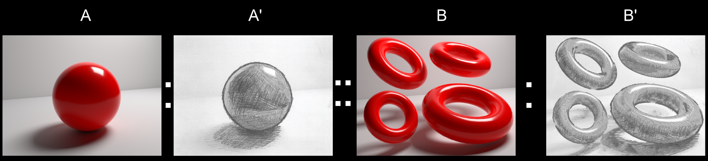
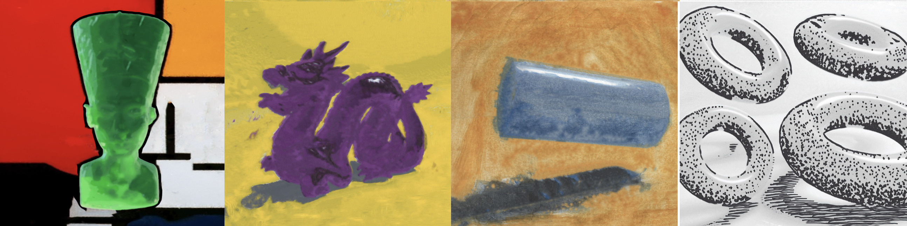
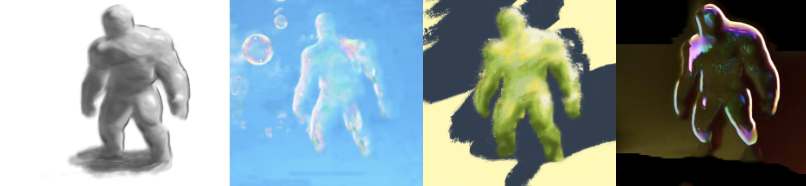
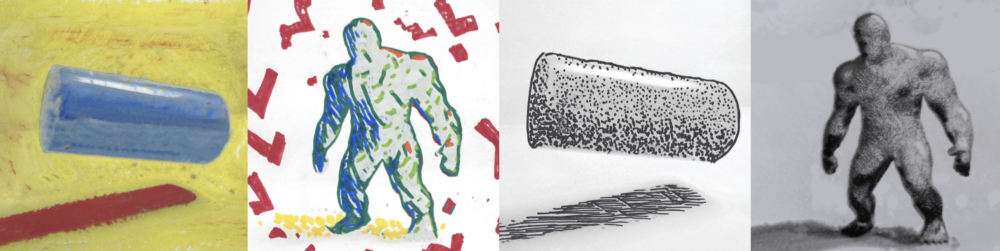
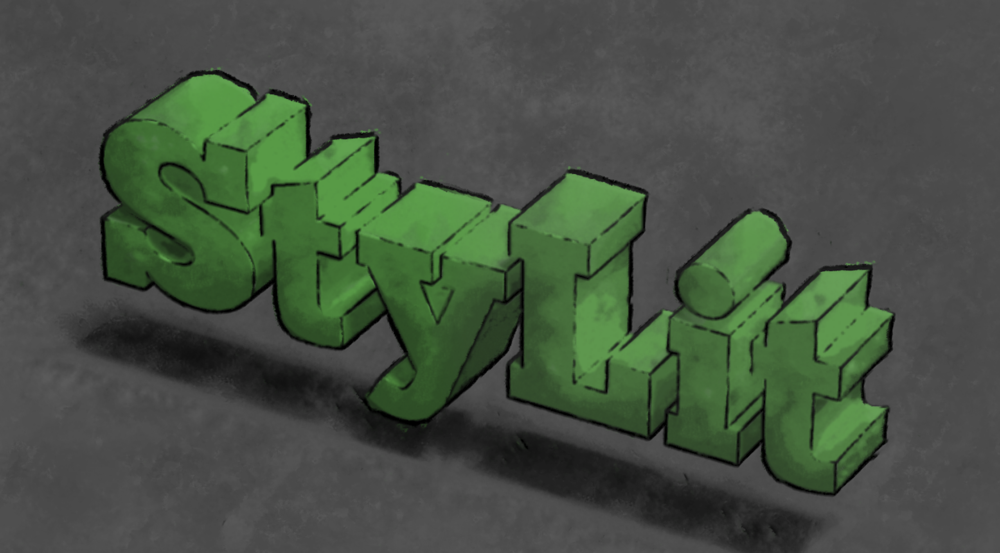

# StyLit

An implementation of StyLit and EbSynth for CSCI 2240. Based on the paper "StyLit: illumination-guided example-based stylization of 3D renderings" by Jakub Fišer et al., SIGGRAPH '16.

[[Watch our Real Time Demo ]](https://youtu.be/4gsjpk9nDbg)

[](https://youtu.be/4gsjpk9nDbg)

## Requirements
- Qt (> 5.9.4)
- C++17

For CPU:
- OpenMP

For GPU:
- CUDA

## Usage

Build the project using Qt Creator or qmake as shown below:
```
cd StyLit
mkdir build
cd build
qmake -makefile ../StyLit.pro
make -j4
```

The program in the master branch can be run with 

`./StyLit --configuration Examples/example_configuration.json`. 

## Overview of program

Refer to
`Examples/example_configuration.json` for how the configuration file should be formatted. Note that more guide channels can be added. The program supports up to 20 guide channels and up to 4 style channels.

To run the StyLit algorithm, `omegaWeight` should be set to `0` in the configuration file, and `nnfGenerationStoppingCriterion` should be set to `.95`.

To run the EbSynth algorithm, `omegaWeight` should be set to a value between `.005` and `.02`, and `nnfGenerationStoppingCriterion` should be
set to `0`.




## Using masks

The background of the target styled image (i.e. the output of this program) tends to need less refinement in the finer levels
of the image pyramid. The program will stop running patchmatch on the background if after the pyramid level indicated by
`maskLevelOptimization` in the configuration file. For instance, if `maskLevelOptimization` is set to `1`, then patchmatch
will not be run on the background at only the finest level of the image pyramid. If `maskLevelOptimization` is set to `2`, 
then patchmatch will not be run on the background at the finest two levels of the image pyramid. To not use this feature,
set `maskLevelOptimization` to 0.

In order to stop using patchmatch on the background, a mask must be provided. Include the mask as the last guide channel
and give it a `guideImageFormats` of `"bw"` and a `guideImageWeights` of `0.0`. If `maskLevelOptimization` is set to `1`
or higher, the program should speed up considerably.

## Note about branches

The master branch contains only the final CPU implementation of StyLit and EbSynth. 

The CUDA implementation of the program is kept in its own separate branch, `dcharatan/cudaWithWeights`.

The final live demo version using CUDA is in the branch `cudaLiveDemo`. The final live demo version for the CPU is in the branch `LiverDemoVersion_1`.

## Content generated by this program





## Speed vs Quality


## References
Fišer, Jakub, et al. "StyLit: illumination-guided example-based stylization of 3D renderings." ACM Transactions on Graphics (TOG) 35.4 (2016): 1-11.

Hertzmann, Aaron, et al. "Image analogies." Proceedings of the 28th annual conference on Computer graphics and interactive techniques. 2001.



